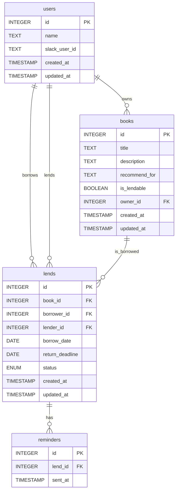

# データベース設計

## テーブル概要

### 1. usersテーブル

ユーザー情報を管理するテーブルです。

| カラム名     | データ型  | NULL | 制約                | 説明                 |
|--------------|-----------|------|---------------------|----------------------|
| id           | INTEGER   | NO   | PRIMARY KEY, AUTO INCREMENT | ユーザーID           |
| name         | TEXT      | NO   |                     | ユーザー名           |
| slack_user_id| TEXT      | NO   | UNIQUE              | SlackのユーザーID    |
| created_at   | TIMESTAMP | NO   | DEFAULT NOW()       | 作成日時             |
| updated_at   | TIMESTAMP | NO   | DEFAULT NOW()       | 更新日時             |

### 2. booksテーブル

紹介された書籍情報を管理するテーブルです。

| カラム名       | データ型  | NULL | 制約                | 説明                  |
|----------------|-----------|------|---------------------|------------------------|
| id             | INTEGER   | NO   | PRIMARY KEY, AUTO INCREMENT | 書籍ID                |
| title          | TEXT      | NO   |                     | 書籍タイトル          |
| description    | TEXT      | YES  |                     | 書籍の感想            |
| recommend_for  | TEXT      | YES  |                     | 誰に向けておすすめか  |
| is_lendable    | BOOLEAN   | NO   | DEFAULT TRUE        | 貸出可能かどうか      |
| owner_id       | INTEGER   | NO   | FOREIGN KEY         | 所有者ID (usersテーブル参照) |
| created_at     | TIMESTAMP | NO   | DEFAULT NOW()       | 作成日時              |
| updated_at     | TIMESTAMP | NO   | DEFAULT NOW()       | 更新日時              |

### 3. lendsテーブル

書籍の貸出情報を管理するテーブルです。

| カラム名        | データ型  | NULL | 制約                | 説明                  |
|-----------------|-----------|------|---------------------|------------------------|
| id              | INTEGER   | NO   | PRIMARY KEY, AUTO INCREMENT | 貸出ID                |
| book_id         | INTEGER   | NO   | FOREIGN KEY         | 書籍ID (booksテーブル参照) |
| borrower_id     | INTEGER   | NO   | FOREIGN KEY         | 借り手ID (usersテーブル参照) |
| lender_id       | INTEGER   | NO   | FOREIGN KEY         | 貸し手ID (usersテーブル参照) |
| borrow_date     | DATE      | NO   | DEFAULT NOW()       | 貸出日                |
| return_deadline | DATE      | NO   |                     | 返却期限              |
| status          | ENUM      | NO   | DEFAULT 'BORROWING' | 貸出状態 (BORROWING, RETURNED) |
| created_at      | TIMESTAMP | NO   | DEFAULT NOW()       | 作成日時              |
| updated_at      | TIMESTAMP | NO   | DEFAULT NOW()       | 更新日時              |

### 4. remindersテーブル

リマインド送信のログを管理するテーブルです。

| カラム名    | データ型  | NULL | 制約                | 説明                  |
|-------------|-----------|------|---------------------|------------------------|
| id          | INTEGER   | NO   | PRIMARY KEY, AUTO INCREMENT | リマインドID          |
| lend_id     | INTEGER   | NO   | FOREIGN KEY         | 貸出ID (lendsテーブル参照) |
| sent_at     | TIMESTAMP | NO   | DEFAULT NOW()       | 送信日時              |

## ER図

